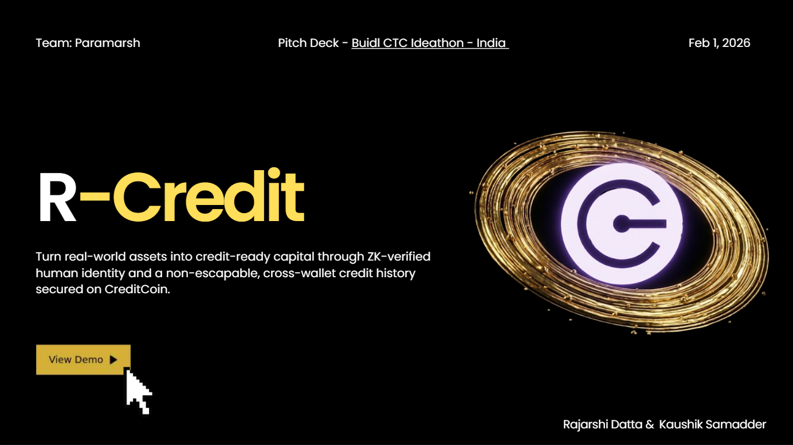

# 🛡️ R-Credit: Non-Escapable Credit Identity Protocol

<div align="center">

**Making Credit History Human-Bound, Not Wallet-Bound**

[](https://opensource.org/licenses/MIT)
[](https://creditcoin.org)
[](https://www.typescriptlang.org/)
[](https://reactjs.org/)

[Demo](http://localhost:8080) · [Documentation](#how-it-works) · [Report Bug](#) · [Request Feature](#)

</div>

---

## 🎯 The Problem

**Credit fails in decentralized systems because identity is resettable.**

- 🔄 One person can create unlimited wallets
- 🗑️ Users can erase their credit history at will
- 🏃 Bad actors escape accountability by switching addresses
- 💰 Protocols resort to 150%+ over-collateralization
- 🚫 Real-world assets become unusable for credit purposes

**Result:** DeFi lending remains speculative gambling, not real finance.

---

## ✨ The Solution

**R-Credit creates a single, non-escapable credit identity per human using zero-knowledge verification.**

Identity is:
- ✅ **Proven once** — Verified off-chain via government ID (PAN + device binding)
- 🔒 **Bound to the person** — Not to wallets, not to addresses
- 🥷 **Preserved privately** — Via on-chain cryptographic commitments
- 🌍 **Portable across protocols** — Works anywhere CreditCoin is integrated
- ⛓️ **Permanently enforceable** — Credit history follows you forever

---

## 🖼️ Screenshots

### Dashboard Interface


### Live Demo


---

## 🔐 How It Works


### 1️⃣ **Identity Verification (Off-Chain)**
```
User → PAN Card + Device Binding → Zero-Knowledge Proof Generation
```
- Verify identity using government-issued PAN (Permanent Account Number)
- Bind verification to device fingerprint
- Generate cryptographic commitment locally
- **No personal data leaves the device**

### 2️⃣ **Identity Commitment (On-Chain)**
```
ZK Proof → Merkle Tree → Root Hash → On-Chain Registry
```
- Cryptographic identity commitment added to Merkle registry
- Only the Merkle root is stored on-chain
- Identity remains private, but verifiable
- **One human = One identity, forever**

### 3️⃣ **Multi-Wallet Operation**
```
Single Identity ← Wallet A, Wallet B, Wallet C
```
- Users can operate unlimited wallets
- All credit activity resolves to the same identity
- Cannot escape history by creating new addresses
- **Accountability is person-bound, not address-bound**

### 4️⃣ **Protected Fund Flow**
```
Loan → Deposit Wallet (Protocol-Controlled) → Authorized Withdrawals Only
```
- Borrowed funds routed through protected deposit wallet
- Prevents theft and unauthorized transfers
- Forces repayment before full access
- **Eliminates "borrow and run" scenarios**

### 5️⃣ **Credit History Accumulation**
```
Borrow → Repay → Credit Score ↑
         Default → Credit Score ↓ (Permanent Record)
```
- Every loan is recorded on CreditCoin's ledger
- Timely repayments increase credit score
- Defaults are permanent and visible to all lenders
- **Reputation becomes your collateral**

---

## 🏗️ Architecture

```
┌─────────────────────────────────────────────────────────┐
│                    Frontend (React)                      │
│  • Identity Verification UI                              │
│  • Borrow/Lend Interface                                 │
│  • Credit Profile Dashboard                              │
│  • RWA Tokenization Platform                             │
└────────────────────┬────────────────────────────────────┘
                     │
┌────────────────────▼────────────────────────────────────┐
│              Identity Layer (ZK Proofs)                  │
│  • PAN Verification                                      │
│  • Device Binding                                        │
│  • Merkle Tree Registry                                  │
│  • Proof Generation & Verification                       │
└────────────────────┬────────────────────────────────────┘
                     │
┌────────────────────▼────────────────────────────────────┐
│           Credit Enforcement Layer                       │
│  • Deposit Wallet Management                             │
│  • Loan Obligation Tracking                              │
│  • Credit Score Calculation                              │
│  • Default Detection & Recording                         │
└────────────────────┬────────────────────────────────────┘
                     │
┌────────────────────▼────────────────────────────────────┐
│              CreditCoin Blockchain                       │
│  • Global Credit Ledger                                  │
│  • Identity Commitment Registry                          │
│  • Cross-Protocol Credit History                         │
└─────────────────────────────────────────────────────────┘
```

---

## 🚀 Key Features

### 🔏 **Zero-Knowledge Identity**
- Prove who you are without revealing personal data
- PAN + device binding creates unique cryptographic fingerprint
- Privacy-preserving verification

### 📊 **Permanent Credit History**
- One identity per human, tracked across all wallets
- Defaults are permanent and visible to all lenders
- Reputation becomes portable collateral

### 🏦 **Protected Deposit Wallet**
- Borrowed funds go to protocol-controlled wallet
- Prevents theft and unauthorized access
- Forces accountability before fund release

### 💎 **RWA Credit Integration**
- Real-world assets become credit-ready
- Token issuers bound to verified identities
- Default on one asset = reputation hit across all assets

### 🌐 **Multi-Wallet Support**
- Operate unlimited addresses
- All resolve to single credit identity
- Cannot escape history by switching wallets

### 📈 **On-Chain Credit Scoring**
- Automated score calculation based on repayment history
- Transparent and auditable
- Better rates for better behavior

---

## 💼 Use Cases

### 🏠 **Undercollateralized Lending**
- Issue loans based on reputation, not just collateral
- Reduce collateral requirements from 150% to 20-50%
- Expand access to credit for emerging markets

### 🏢 **RWA Financing**
- Finance real-world assets (real estate, invoices, commodities)
- Borrower reputation makes assets credit-ready
- Defaults tracked across all issued tokens

### 🌍 **Cross-Border Credit**
- Credit history portable across countries and protocols
- No need to rebuild reputation in each market
- Global financial passport

### 🏭 **Supply Chain Finance**
- Verify supplier creditworthiness instantly
- Reduce counterparty risk
- Faster, cheaper trade financing

### 🎨 **NFT-Backed Loans**
- Combine NFT collateral with borrower reputation
- Better rates for trusted borrowers
- Reduce liquidation risk

---

## 🎯 Why It Matters

### For **Lenders**
✅ Lower default rates through accountability  
✅ Better risk pricing via credit scores  
✅ Reduced need for over-collateralization  
✅ Transparent borrower history  

### For **Borrowers**
✅ Access to unsecured or lightly secured loans  
✅ Better rates for good behavior  
✅ Portable credit history  
✅ Privacy-preserving verification  

### For **DeFi Protocols**
✅ Expand total addressable market  
✅ Attract institutional capital  
✅ Reduce systemic risk  
✅ Enable real-world asset integration  

### For **RWA Issuers**
✅ Assets become financeable, not just tradable  
✅ Reputation bound to all issued tokens  
✅ Investor protection through enforced transparency  
✅ Credit-aware infrastructure from day one  

---

## 🛠️ Tech Stack

### Frontend
- **React 18** — UI framework
- **TypeScript** — Type safety
- **Vite** — Build tool
- **TailwindCSS** — Styling
- **Shadcn/ui** — Component library
- **Framer Motion** — Animations
- **React Router** — Navigation

### Backend (Simulated)
- **Zero-Knowledge Proofs** — Identity verification
- **Merkle Trees** — Identity registry
- **Smart Contracts** — Deposit wallet management

### Blockchain
- **CreditCoin** — Credit ledger and identity registry
- **Ethereum-compatible** — EVM chains for smart contracts

---

## 🏃 Getting Started

### Prerequisites
```bash
node >= 18.0.0
npm or bun
```

### Installation

1. **Clone the repository**
```bash
git clone https://github.com/yourusername/trust-ledger.git
cd trust-ledger
```

2. **Install dependencies**
```bash
npm install
# or
bun install
```

3. **Start development server**
```bash
npm run dev
# or
bun run dev
```

4. **Open in browser**
```
http://localhost:8080
```

### User Flow

1. **New User**: Navigate to `/verify`
   - Enter PAN number
   - Complete device binding
   - Identity created with ZK proof

2. **Existing User**: Navigate to `/dashboard`
   - View credit score and history
   - Access borrow/lend markets
   - Manage vault and deposits

3. **RWA Tokenization**: Navigate to `/rwa-tokenization`
   - Tokenize real-world assets
   - Issue credit-bound tokens
   - Trade with reputation visibility

---

## 🌟 Impact on Real-World Assets (RWAs)

### Before R-Credit
❌ RWA tokens are just tradeable, not financeable  
❌ Issuers can default and disappear  
❌ No credit history for new issuers  
❌ Investors have no recourse  

### After R-Credit
✅ **Credit-Ready Assets** — Every token is bound to issuer's verified identity  
✅ **Enforced Accountability** — Defaults tracked across all issuer's assets  
✅ **Investor Protection** — Full credit history visible before purchase  
✅ **Financeable, Not Just Tradeable** — Assets can be borrowed against, not just bought/sold  

**Example:** Alice tokenizes her coffee harvest. Her PAN-verified identity is cryptographically bound to the token. If she defaults on obligations, her credit score drops across **all** her issued assets. Future investors see her full history. She can't escape by creating a new wallet.

---

## 🔗 Built on CreditCoin

R-Credit is designed as an **identity and credit enforcement layer** for [CreditCoin](https://creditcoin.org), complementing its global credit ledger by making credit history **human-bound** rather than **wallet-bound**.

### Integration with CreditCoin
- **Identity Registry** — ZK identity commitments stored on CreditCoin
- **Credit Ledger** — All loans and repayments recorded on-chain
- **Cross-Protocol History** — Credit score portable across CreditCoin integrations
- **Global Accessibility** — Works anywhere CreditCoin is supported

---

## 📋 Roadmap

### Phase 1: Core Identity (Current)
- ✅ PAN verification flow
- ✅ Device binding
- ✅ ZK proof generation (simulated)
- ✅ Dashboard UI

### Phase 2: Credit Enforcement
- 🔄 Smart contract deployment
- 🔄 Deposit wallet implementation
- 🔄 Credit score algorithm
- 🔄 Default tracking

### Phase 3: RWA Integration
- ✅ Asset tokenization UI
- 🔄 Credit-bound token standard
- 🔄 Multi-asset issuer tracking
- 🔄 Investor protection mechanisms

### Phase 4: CreditCoin Mainnet
- 📅 Mainnet deployment
- 📅 Real PAN API integration
- 📅 Multi-chain support
- 📅 Institutional partnerships

### Phase 5: Scale
- 📅 Multi-country ID support
- 📅 Credit score oracle
- 📅 Lending protocol SDK
- 📅 Cross-border credit markets

---

## 🤝 Contributing

We welcome contributions! Please see our [Contributing Guide](CONTRIBUTING.md) for details.

### Development
```bash
# Run tests
npm test

# Run linter
npm run lint

# Build for production
npm run build
```

---

## 📄 License

This project is licensed under the MIT License - see the [LICENSE](LICENSE) file for details.

---

## 🙏 Acknowledgments

- **CreditCoin** — For building the global credit ledger infrastructure
- **Zero-Knowledge Proof Research** — For privacy-preserving identity verification
- **DeFi Community** — For pushing the boundaries of decentralized finance

---

## 📞 Contact

- **Website**: [r-credit.io](https://r-credit.io)
- **Twitter**: [@RCreditProtocol](https://twitter.com/RCreditProtocol)
- **Discord**: [Join our community](https://discord.gg/rcredit)
- **Email**: contact@r-credit.io

---

<div align="center">

**Built with ❤️ for a more accessible, accountable, and trustless financial future.**

[⬆ Back to Top](#-r-credit-non-escapable-credit-identity-protocol)

</div>
